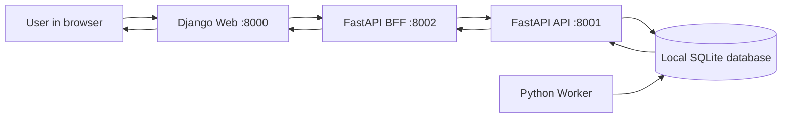

# FleetOps architecture, explained

## What is the app about?

FleetOps is a small fleet-management app. For now it supports two simple concepts:

- **Vehicle:** a fleet vehicle identified by registration, make, model, and year.
- **Maintenance job:** work requested for a vehicle. Its status moves from `queued` to `processing` and then to `completed` (or `failed` if processing errors).

The point of the sample is also to show how one user-facing application can be split into a Web app, an API, a BFF, and a background Worker.

## The four application services

### 1. Web — Django

The Web service is the page a person opens in their browser. It displays vehicle and job information and offers a form to request maintenance. It does not access the database directly; it asks the BFF for information.

Address: <http://127.0.0.1:8000>

### 2. BFF — Backend for Frontend, FastAPI

BFF means **Backend for Frontend**. This service gives the Web page endpoints shaped for its needs. It combines vehicle and job data from the API and forwards maintenance requests. That keeps browser-facing behavior separate from the API's core business endpoints.

Address: <http://127.0.0.1:8002>

### 3. API — FastAPI

The API owns the REST endpoints and stores fleet data. It validates vehicles and jobs, checks that a requested vehicle exists, and writes jobs in the `queued` state. The interactive API explorer is at <http://127.0.0.1:8001/docs>.

Address: <http://127.0.0.1:8001>

### 4. Worker — Python background process

The Worker is not a website and has no browser address. It repeatedly looks for queued jobs in the database. When it finds one, it marks it as processing, performs the sample work, and stores the result. The demo keeps a job in `processing` for two seconds by default so the transition can be observed; set `JOB_PROCESSING_SECONDS` to change that delay. The page can then show the final status.

## Request and job flow

When someone submits a job:

1. The browser sends the form to the Django Web service.
2. Web sends the request to the BFF.
3. BFF forwards it to the API.
4. API checks the vehicle and writes a `queued` job to the database.
5. Worker finds the queued row, processes it, and stores the result.
6. The dashboard polls for updated jobs every second, so the status changes without manually reloading the page.

## Shared code layers

The shared Python code separates business concepts from HTTP and database details:

- **Domain:** entities and concepts such as `Vehicle`, `MaintenanceJob`, and `JobStatus`.
- **Application:** rules/use cases such as checking required vehicle data and validating job descriptions.
- **Infrastructure:** database engine, SQLAlchemy models, and repository implementation.
- **DAL:** Data Access Layer. It provides the operations the API uses to read and write vehicle/job records.

Alembic migrations describe database schema changes. The API and Worker currently also create missing tables at startup to make a first local run forgiving; running the migration remains the documented setup path.

## Local-development database

By default, the application uses `sqlite:///./fleetops.db`, which creates a `fleetops.db` file in the repository root. Every local service must run from that root and use the same `DATABASE_URL`; otherwise, they may use different database files and fail to see the same vehicles/jobs.

SQLite is convenient for learning because no database server is needed. The planned containerized environment will use PostgreSQL to match the target CI/CD architecture.

## Important distinction

The four services are the four application components. SQLite/PostgreSQL is a dependency, not a fifth application service. The Worker is counted as a service even though it does not listen on an HTTP port.
